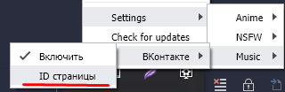

## SM Discord
>SM Discord - это Discord RPC для ваших любимых сайтов.

#
### Установка:
1. Установить расширение для вашего браузера из папки **extension**
2. Скачать приложение:
[Windows](https://github.com/DivineGSocketUser/SM-Discord/releases/lastest "Windows")
### Настройка для ВКонтакте

1. Открыть приложение в трее [ПКМ].
2. Выбрать в контекстном меню Settings>Music>ВКонтакте>ID страницы.
3. 
4. Вставить свой ID и нажать сохранить.

### Сервисы, которые уже поддерживаются
| Anime      |  NSFW   |     Music |
| :--------- | :-----: | --------: |
| AniLibiria | PornHub | ВКонтакте |
| MangaLib   |         |           |

>Если вы хотите, чтобы добавили **ваш сервис**, то напишите в **discord:** *someone#6191*